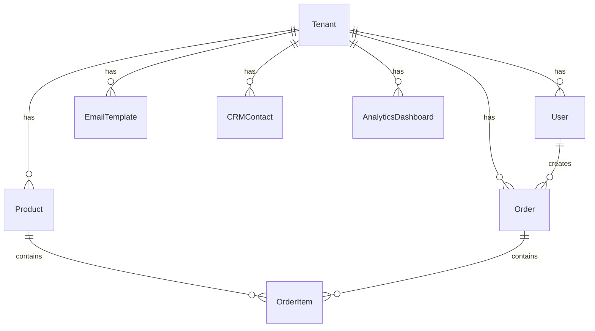

# 🚀 Rockket Developer Guide - Technical Documentation

> **Complete technical documentation for developers building on the Rockket platform.**

## 📋 Table of Contents

1. [Architecture Overview](#architecture-overview)
2. [Database Schema](#database-schema)
3. [API Reference](#api-reference)
4. [Authentication & Security](#authentication--security)
5. [Multi-Tenancy](#multi-tenancy)
6. [AI Integration](#ai-integration)
7. [Frontend Development](#frontend-development)
8. [Deployment & Infrastructure](#deployment--infrastructure)
9. [Testing](#testing)
10. [Contributing](#contributing)

---

## 🏗️ Architecture Overview

### System Architecture

Rockket is built on a modern, cloud-native architecture using Cloudflare's edge infrastructure:

```
┌─────────────────────────────────────────────────────────────┐
│                    Cloudflare Edge Network                   │
├─────────────────────────────────────────────────────────────┤
│  Next.js Frontend  │  Cloudflare Workers  │  Durable Objects │
│  (React/TypeScript)│  (API Routes)         │  (AI Agents)     │
├─────────────────────────────────────────────────────────────┤
│  D1 Database       │  R2 Storage           │  KV Storage      │
│  (PostgreSQL)      │  (File Storage)      │  (Caching)       │
├─────────────────────────────────────────────────────────────┤
│  AI Gateway        │  External APIs        │  Webhooks        │
│  (Multi-Provider)  │  (Stripe, Twilio)    │  (Event System)  │
└─────────────────────────────────────────────────────────────┘
```

### Core Technologies

- **Frontend**: Next.js 14, React 18, TypeScript, Tailwind CSS
- **Backend**: Cloudflare Workers, Durable Objects
- **Database**: D1 (SQLite at the edge), Prisma ORM
- **Storage**: R2 (Object storage), KV (Key-value store)
- **AI**: Cloudflare AI Gateway (Claude, OpenAI, Google AI)
- **Authentication**: JWT with role-based access control
- **Deployment**: Cloudflare Pages, Workers, Durable Objects

---

## 🗄️ Database Schema

### Core Models

#### Tenant Model

```typescript
model Tenant {
  id        String   @id @default(cuid())
  name      String
  slug      String   @unique
  domain    String?
  settings  Json     @default("{}")
  plan      String   @default("free")
  status    String   @default("active")
  createdAt DateTime @default(now())
  updatedAt DateTime @updatedAt

  // 97+ relations to all platform features
  users     User[]
  content   Content[]
  products  Product[]
  // ... all other relations
}
```

#### User Model

```typescript
model User {
  id        String   @id @default(cuid())
  email     String   @unique
  name      String
  avatar    String?
  role      String   @default("member")
  tenantId  String
  createdAt DateTime @default(now())
  updatedAt DateTime @updatedAt

  tenant    Tenant   @relation(fields: [tenantId], references: [id])
  // ... all other relations
}
```

### Feature-Specific Models

#### E-commerce Models

- **Product**: Catalog management with variants
- **Order**: Complete order lifecycle
- **OrderItem**: Individual order items
- **OrderPayment**: Payment tracking
- **Inventory**: Stock management
- **ShippingZone**: Shipping configuration
- **TaxRate**: Tax calculation

#### Marketing Models

- **EmailTemplate**: Email templates
- **EmailSequence**: Automated sequences
- **EmailCampaign**: Campaign management
- **EmailDelivery**: Delivery tracking
- **EmailSubscriber**: Subscriber management
- **SMSMessage**: SMS communications
- **CallLog**: Voice call tracking

#### CRM Models

- **CRMContact**: Customer contacts
- **CRMPipeline**: Sales pipelines
- **CRMPipelineStage**: Pipeline stages
- **CRMDeal**: Sales opportunities
- **CRMActivity**: Activity tracking

#### Analytics Models

- **AnalyticsDashboard**: Custom dashboards
- **AnalyticsReport**: Report definitions
- **AnalyticsReportRun**: Report executions
- **RevenueMetric**: Revenue tracking
- **UserEngagement**: Engagement metrics

### Database Relationships



---

## 🔌 API Reference

### Authentication Endpoints

#### POST /api/auth/login

```typescript
interface LoginRequest {
  email: string;
  password: string;
}

interface LoginResponse {
  user: User;
  token: string;
  tenant: Tenant;
}
```

#### POST /api/auth/register

```typescript
interface RegisterRequest {
  email: string;
  password: string;
  name: string;
  tenantName: string;
}

interface RegisterResponse {
  user: User;
  token: string;
  tenant: Tenant;
}
```

#### GET /api/auth/me

```typescript
interface MeResponse {
  user: User;
  tenant: Tenant;
  permissions: string[];
}
```

### E-commerce Endpoints

#### Products API

```typescript
// GET /api/ecommerce/products
interface ProductsResponse {
  products: Product[];
  total: number;
  page: number;
  limit: number;
}

// POST /api/ecommerce/products
interface CreateProductRequest {
  name: string;
  description: string;
  price: number;
  currency: string;
  sku: string;
  inventory: number;
  images: string[];
  variants: ProductVariant[];
  tenantId: string;
}
```

#### Orders API

```typescript
// GET /api/ecommerce/orders
interface OrdersResponse {
  orders: Order[];
  total: number;
  page: number;
  limit: number;
}

// POST /api/ecommerce/orders
interface CreateOrderRequest {
  customerEmail: string;
  customerName: string;
  items: OrderItem[];
  shippingAddress: Address;
  billingAddress: Address;
  tenantId: string;
}
```

### Marketing Endpoints

#### Email Marketing API

```typescript
// GET /api/email/templates
interface EmailTemplatesResponse {
  templates: EmailTemplate[];
}

// POST /api/email/campaigns
interface CreateCampaignRequest {
  name: string;
  subject: string;
  templateId: string;
  recipientList: string[];
  scheduledAt?: Date;
  tenantId: string;
}
```

#### SMS API

```typescript
// POST /api/sms/messages
interface SendSMSRequest {
  to: string;
  message: string;
  tenantId: string;
}
```

### Analytics Endpoints

#### Analytics API

```typescript
// GET /api/analytics/metrics
interface AnalyticsMetricsResponse {
  revenue: RevenueMetric[];
  engagement: UserEngagement[];
  conversions: ConversionMetric[];
  period: string;
}

// POST /api/analytics/track
interface TrackEventRequest {
  event: string;
  properties: Record<string, any>;
  userId?: string;
  sessionId: string;
  tenantId: string;
}
```

### AI Generation Endpoints

#### AI Business Generator

```typescript
// POST /api/ai/business-generate
interface BusinessGenerateRequest {
  description: string;
  businessType: string;
  features: string[];
  tenantId: string;
}

interface BusinessGenerateResponse {
  projectId: string;
  status: "generating" | "completed" | "failed";
  progress: number;
  result?: GeneratedApplication;
}
```

---

## 🔐 Authentication & Security

### JWT Authentication

```typescript
interface JWTPayload {
  userId: string;
  tenantId: string;
  role: string;
  permissions: string[];
  exp: number;
  iat: number;
}
```

### Role-Based Access Control

```typescript
enum UserRole {
  ADMIN = "admin",
  OWNER = "owner",
  MEMBER = "member",
  VIEWER = "viewer",
}

interface Permission {
  resource: string;
  action: string;
  conditions?: Record<string, any>;
}
```

### Security Middleware

```typescript
// Authentication middleware
export async function authenticate(request: NextRequest) {
  const token = request.headers.get("authorization")?.replace("Bearer ", "");

  if (!token) {
    throw new Error("No token provided");
  }

  const payload = jwt.verify(token, process.env.JWT_SECRET!) as JWTPayload;
  return payload;
}

// Authorization middleware
export async function authorize(
  user: JWTPayload,
  resource: string,
  action: string
) {
  const permissions = await getUserPermissions(user.userId);
  return permissions.some(
    (p) => p.resource === resource && p.action === action
  );
}
```

---

## 🏢 Multi-Tenancy

### Tenant Isolation

```typescript
// All database queries include tenant filtering
export async function getProducts(tenantId: string) {
  return prisma.product.findMany({
    where: { tenantId },
    include: { tenant: true },
  });
}

// Middleware for tenant context
export async function withTenant(
  request: NextRequest,
  handler: (request: NextRequest, tenantId: string) => Promise<Response>
) {
  const user = await authenticate(request);
  return handler(request, user.tenantId);
}
```

### Tenant Configuration

```typescript
interface TenantSettings {
  branding: {
    logo: string;
    colors: Record<string, string>;
    fonts: Record<string, string>;
  };
  features: {
    ecommerce: boolean;
    crm: boolean;
    analytics: boolean;
    ai: boolean;
  };
  limits: {
    users: number;
    storage: number;
    apiCalls: number;
  };
}
```

---

## 🤖 AI Integration

### VibeSDK Integration

```typescript
import { VibeSDK } from "@cloudflare/vibesdk";

const vibeSDK = new VibeSDK({
  apiKey: process.env.VIBE_API_KEY,
  environment: process.env.NODE_ENV,
});

// Generate application from description
export async function generateApplication(description: string) {
  const result = await vibeSDK.generate({
    prompt: description,
    type: "full-stack-application",
    options: {
      framework: "nextjs",
      database: "postgresql",
      deployment: "cloudflare",
    },
  });

  return result;
}
```

### AI Provider Management

```typescript
interface AIProvider {
  name: string;
  type: "text" | "image" | "code";
  config: {
    apiKey: string;
    model: string;
    maxTokens: number;
  };
}

// Multi-provider AI service
export class AIService {
  private providers: Map<string, AIProvider> = new Map();

  async generateContent(
    prompt: string,
    provider: string = "claude"
  ): Promise<string> {
    const aiProvider = this.providers.get(provider);
    if (!aiProvider) {
      throw new Error(`Provider ${provider} not found`);
    }

    return await this.callProvider(aiProvider, prompt);
  }
}
```

---

## 🎨 Frontend Development

### Component Architecture

```typescript
// Base component with tenant context
export interface BaseComponentProps {
  tenantId: string;
  user: User;
  permissions: string[];
}

// Dashboard component structure
export function DashboardLayout({ children }: { children: React.ReactNode }) {
  const { user, tenant } = useAuth();

  return (
    <div className="min-h-screen bg-gray-50">
      <Sidebar tenant={tenant} user={user} />
      <main className="ml-64">
        <Header user={user} />
        {children}
      </main>
    </div>
  );
}
```

### State Management

```typescript
// Context providers for global state
export function AuthProvider({ children }: { children: React.ReactNode }) {
  const [user, setUser] = useState<User | null>(null);
  const [tenant, setTenant] = useState<Tenant | null>(null);
  const [loading, setLoading] = useState(true);

  // Authentication logic
  const login = async (email: string, password: string) => {
    const response = await fetch('/api/auth/login', {
      method: 'POST',
      headers: { 'Content-Type': 'application/json' },
      body: JSON.stringify({ email, password })
    });

    const data = await response.json();
    setUser(data.user);
    setTenant(data.tenant);
    localStorage.setItem('token', data.token);
  };

  return (
    <AuthContext.Provider value={{ user, tenant, login, logout }}>
      {children}
    </AuthContext.Provider>
  );
}
```

### API Client

```typescript
// Typed API client
export class APIClient {
  private baseURL: string;
  private token: string;

  constructor(baseURL: string, token: string) {
    this.baseURL = baseURL;
    this.token = token;
  }

  async request<T>(endpoint: string, options: RequestInit = {}): Promise<T> {
    const response = await fetch(`${this.baseURL}${endpoint}`, {
      ...options,
      headers: {
        Authorization: `Bearer ${this.token}`,
        "Content-Type": "application/json",
        ...options.headers,
      },
    });

    if (!response.ok) {
      throw new Error(`API Error: ${response.status}`);
    }

    return response.json();
  }

  // Typed methods
  async getProducts(tenantId: string): Promise<Product[]> {
    return this.request<Product[]>(
      `/api/ecommerce/products?tenantId=${tenantId}`
    );
  }

  async createProduct(product: CreateProductRequest): Promise<Product> {
    return this.request<Product>("/api/ecommerce/products", {
      method: "POST",
      body: JSON.stringify(product),
    });
  }
}
```

---

## 🚀 Deployment & Infrastructure

### Cloudflare Workers Configuration

```typescript
// wrangler.toml
[env.production];
name = "rockket-api";
compatibility_date = "2024-01-01"[[env.production.d1_databases]];
binding = "DB";
database_name = "rockket-prod";
database_id = "your-database-id"[[env.production.kv_namespaces]];
binding = "CACHE";
id = "your-kv-namespace-id"[[env.production.r2_buckets]];
binding = "STORAGE";
bucket_name = "rockket-storage";
```

### Durable Objects

```typescript
// AI Agent Durable Object
export class AIAgent {
  constructor(state: DurableObjectState, env: Env) {
    this.state = state;
    this.env = env;
  }

  async fetch(request: Request): Promise<Response> {
    const url = new URL(request.url);

    switch (url.pathname) {
      case "/generate":
        return this.handleGeneration(request);
      case "/status":
        return this.handleStatus(request);
      default:
        return new Response("Not Found", { status: 404 });
    }
  }

  private async handleGeneration(request: Request) {
    const { prompt, type } = await request.json();

    // Store generation state
    await this.state.storage.put("generation", {
      prompt,
      type,
      status: "generating",
      progress: 0,
    });

    // Start generation process
    this.generateApplication(prompt, type);

    return new Response(
      JSON.stringify({
        id: this.state.id.toString(),
        status: "generating",
      })
    );
  }
}
```

### Database Migrations

```typescript
// Prisma migration example
// migrations/0001_initial_schema.sql
CREATE TABLE "tenants" (
  "id" TEXT PRIMARY KEY,
  "name" TEXT NOT NULL,
  "slug" TEXT UNIQUE NOT NULL,
  "domain" TEXT,
  "settings" JSONB DEFAULT '{}',
  "plan" TEXT DEFAULT 'free',
  "status" TEXT DEFAULT 'active',
  "createdAt" TIMESTAMP DEFAULT CURRENT_TIMESTAMP,
  "updatedAt" TIMESTAMP DEFAULT CURRENT_TIMESTAMP
);

-- Add indexes for performance
CREATE INDEX "tenants_slug_idx" ON "tenants"("slug");
CREATE INDEX "tenants_domain_idx" ON "tenants"("domain");
```

---

## 🧪 Testing

### Unit Testing

```typescript
// API route testing
import { describe, it, expect, beforeEach } from "vitest";
import { GET, POST } from "@/app/api/ecommerce/products/route";

describe("Products API", () => {
  beforeEach(() => {
    // Setup test database
  });

  it("should fetch products for tenant", async () => {
    const request = new Request(
      "http://localhost/api/ecommerce/products?tenantId=test-tenant"
    );
    const response = await GET(request);
    const data = await response.json();

    expect(response.status).toBe(200);
    expect(data.products).toBeDefined();
    expect(Array.isArray(data.products)).toBe(true);
  });

  it("should create new product", async () => {
    const productData = {
      name: "Test Product",
      price: 99.99,
      tenantId: "test-tenant",
    };

    const request = new Request("http://localhost/api/ecommerce/products", {
      method: "POST",
      body: JSON.stringify(productData),
    });

    const response = await POST(request);
    const data = await response.json();

    expect(response.status).toBe(201);
    expect(data.product.name).toBe("Test Product");
  });
});
```

### Integration Testing

```typescript
// End-to-end testing
describe("E-commerce Flow", () => {
  it("should complete full purchase flow", async () => {
    // 1. Create product
    const product = await createProduct({
      name: "Test Product",
      price: 99.99,
    });

    // 2. Add to cart
    const cart = await addToCart(product.id, 1);

    // 3. Create order
    const order = await createOrder({
      items: cart.items,
      customerEmail: "test@example.com",
    });

    // 4. Process payment
    const payment = await processPayment(order.id, {
      amount: order.total,
      method: "card",
    });

    // 5. Verify order completion
    expect(payment.status).toBe("completed");
    expect(order.status).toBe("paid");
  });
});
```

### Performance Testing

```typescript
// Load testing with k6
import http from "k6/http";
import { check } from "k6";

export let options = {
  stages: [
    { duration: "2m", target: 100 },
    { duration: "5m", target: 100 },
    { duration: "2m", target: 200 },
    { duration: "5m", target: 200 },
    { duration: "2m", target: 0 },
  ],
};

export default function () {
  const response = http.get("https://api.rockket.dev/api/ecommerce/products");

  check(response, {
    "status is 200": (r) => r.status === 200,
    "response time < 500ms": (r) => r.timings.duration < 500,
  });
}
```

---

## 🤝 Contributing

### Development Setup

```bash
# Clone repository
git clone https://github.com/your-org/rockket.git
cd rockket

# Install dependencies
npm install

# Setup environment
cp .env.example .env.local
# Configure your environment variables

# Setup database
npx prisma migrate dev
npx prisma generate

# Start development server
npm run dev
```

### Code Standards

```typescript
// TypeScript configuration
{
  "compilerOptions": {
    "strict": true,
    "noImplicitAny": true,
    "strictNullChecks": true,
    "strictFunctionTypes": true,
    "noImplicitReturns": true,
    "noFallthroughCasesInSwitch": true
  }
}
```

### Git Workflow

```bash
# Feature branch workflow
git checkout -b feature/new-feature
# Make changes
git add .
git commit -m "feat: add new feature"
git push origin feature/new-feature
# Create pull request
```

### Pull Request Guidelines

1. **Code Quality**: All code must pass linting and type checking
2. **Testing**: Include tests for new features
3. **Documentation**: Update documentation for API changes
4. **Performance**: Consider performance implications
5. **Security**: Follow security best practices

---

## 📚 Additional Resources

### API Documentation

- **OpenAPI Spec**: `/api/docs` endpoint
- **Postman Collection**: Available in repository
- **SDK Examples**: TypeScript/JavaScript SDKs

### Development Tools

- **Prisma Studio**: Database management UI
- **Cloudflare Dashboard**: Worker monitoring
- **Sentry**: Error tracking and monitoring
- **Analytics**: Performance and usage analytics

### Community

- **GitHub Discussions**: Technical discussions
- **Discord Server**: Real-time chat support
- **Stack Overflow**: Tag `rockket` for questions
- **Blog**: Technical articles and tutorials

---

_For technical support, feature requests, or partnership opportunities, contact us at dev@rockket.dev_
